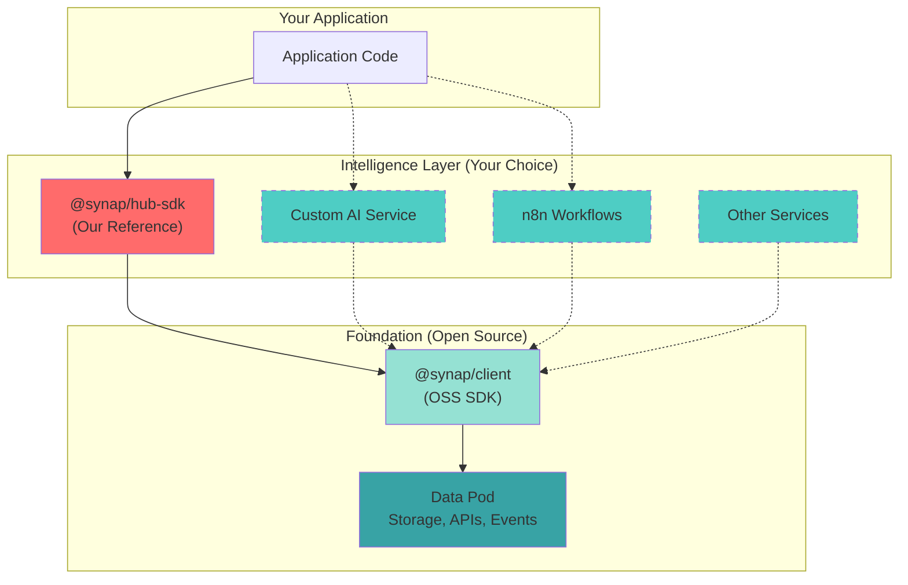
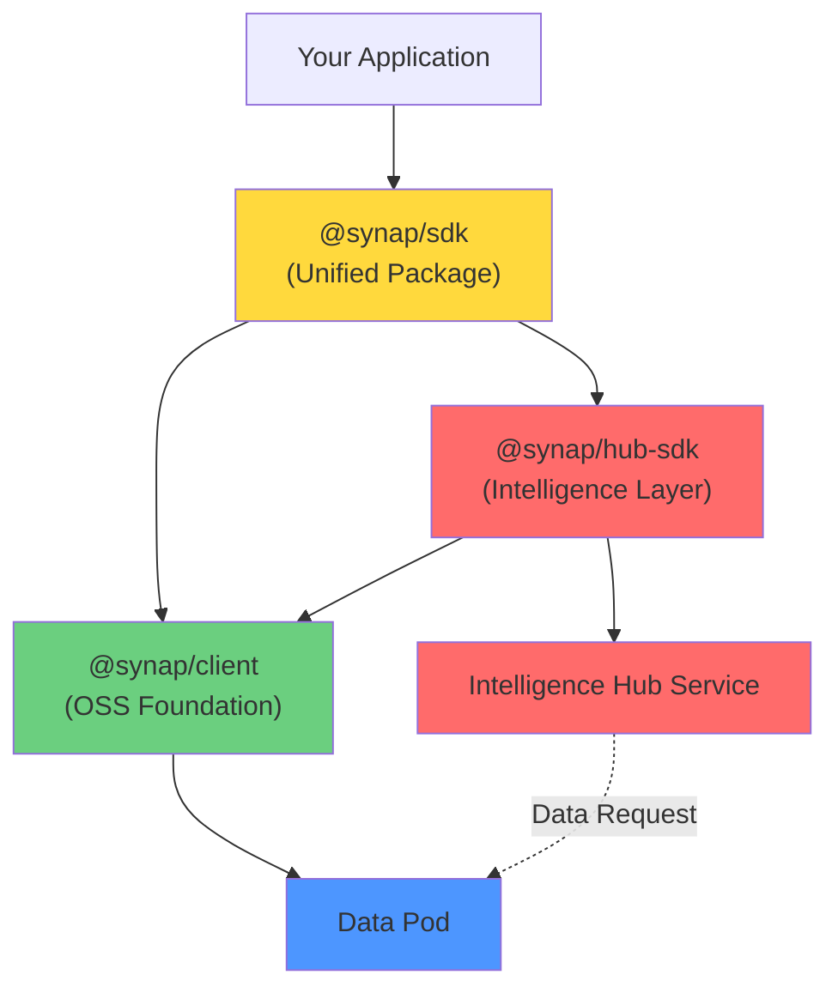

# Synap Hub SDK (`@synap/hub-sdk`)

> [!WARNING]
> This SDK is **proprietary** and for internal use within Synap applications. It represents our reference implementation of an intelligence layer.

The Synap Hub SDK extends the [OSS Data Pod SDK](/docs/api/client-sdk) with AI orchestration, agentic workflows, and intelligent automation. It demonstrates what's possible when you build an intelligence layer on top of the extensible Data Pod architecture.

---

## The Extensible Intelligence Layer Architecture

The Synap platform is designed so that **anyone can build their own intelligence layer** on top of the Data Pod:



### Key Points

- The **Data Pod** is open, extensible, and the foundation
- **@synap/hub-sdk** is ONE example of what can be built on top
- **You can build your own** intelligence layer using custom AI, workflows, or automation
- Multiple intelligence layers can coexist and complement each other

> [!TIP]
> **Building Your Own Intelligence Layer?**
> 
> See the [Extensibility Guide](/docs/development/extensibility/extensibility-guide) to learn how to create custom intelligence services on top of the Data Pod.

---

## Installation

```bash
# Full unified SDK (includes @synap/client + @synap/hub-sdk)
pnpm add @synap/sdk

# Or just the Hub SDK
pnpm add @synap/hub-sdk
```

---

## Architecture

The Hub SDK is structured in three layers:



### Package Structure

1. **`@synap/sdk`** - Unified entry point (re-exports `@synap/client` + `@synap/hub-sdk`)
2. **`@synap/hub-sdk`** - Intelligence Hub functionality
3. **`@synap/client`** - OSS Data Pod access

---

## Initialization

### Using the Unified SDK (`@synap/sdk`)

```typescript
import { SynapHubClient } from '@synap/sdk';

const client = new SynapHubClient({
  url: 'http://localhost:3000',      // Data Pod URL
  hubUrl: 'http://localhost:3001',   // Intelligence Hub URL
  getToken: async () => getSessionToken()
});

// Access Data Pod (OSS features)
await client.notes.create({ content: '# Note', title: 'Note' });

// Access Intelligence Hub (Proprietary features)
const response = await client.intelligence.chat('Create a task');
```

### Using Just the Hub SDK

```typescript
import { SynapHubClient } from '@synap/hub-sdk';

const client = new SynapHubClient({
  url: 'http://localhost:3000',
  hubUrl: 'http://localhost:3001',
  getToken: async () => getSessionToken()
});
```

---

## Intelligence Features

The `intelligence` facade provides AI orchestration and agentic workflows.

### Chat with AI Orchestrator

Interact with the agentic loop for intelligent task execution.

```typescript
const response = await client.intelligence.chat(
  'Create a task to call John tomorrow',
  {
    userId: 'user-123',
    threadId: 'thread-abc',
    history: [
      { role: 'user', content: 'Previous message' },
      { role: 'assistant', content: 'Previous response' }
    ]
  }
);

// Response structure
if (response.success) {
  // AI thinking process
  console.log(response.thinkingSteps);
  // [{ type: 'thought', content: 'User wants to create a task...' }]
  
  // Proposed actions
  console.log(response.proposals);
  // [{ toolName: 'create_task', args: { title: 'Call John' } }]
  
  // Final response
  console.log(response.content);
  // "I've created a task to call John tomorrow."
} else {
  console.error(response.error);
}
```

### Response Types

```typescript
interface OrchestrateResponse {
  success: boolean;
  error?: string;
  
  // AI thinking process (visible to user)
  thinkingSteps?: Array<{
    type: 'thought' | 'tool_use' | 'observation';
    content: string;
    toolName?: string;
    toolInput?: any;
  }>;
  
  // Proposed actions (require approval)
  proposals?: Array<{
    id: string;
    toolName: string;
    args: Record<string, any>;
    reasoning: string;
  }>;
  
  // Final content to display
  content?: string;
}
```

---

### Proposal Management

The Hub SDK uses a **Human-in-the-Loop** workflow where AI proposes actions that require user approval.

#### Approve Proposals

```typescript
// User reviews and approves proposals
const approvalResponse = await client.intelligence.approveProposals(
  response.proposals
);

if (approvalResponse.success) {
  console.log('Actions executed:', approvalResponse.results);
} else {
  console.error('Execution failed:', approvalResponse.error);
}
```

#### Reject Proposals (Client-Side)

```typescript
// User rejects a specific proposal
client.intelligence.rejectProposal('proposal-id-123');
```

> [!NOTE]
> **Design Pattern: Trust but Verify**
> 
> The Hub SDK implements a safety pattern where AI can propose actions but cannot execute them without explicit user approval. This ensures transparency and user control.

---

### Health Check

Verify the Intelligence Hub is available.

```typescript
const isHealthy = await client.intelligence.healthCheck();
if (isHealthy) {
  console.log('Intelligence Hub is online');
}
```

---

## React Integration

Use `@synap/sdk/react` for React applications.

```tsx
import { SynapProvider, useSynap } from '@synap/sdk/react';

// 1. Wrap your app
function App() {
  return (
    <SynapProvider 
      url="http://localhost:3000"
      hubUrl="http://localhost:3001"
      getToken={async () => await getSessionToken()}
    >
      <ChatInterface />
    </SynapProvider>
  );
}

// 2. Use the unified client
function ChatInterface() {
  const synap = useSynap();
  const [input, setInput] = useState('');
  const [thinking, setThinking] = useState<string[]>([]);

  const handleSend = async () => {
    // Use intelligence features
    const response = await synap.intelligence.chat(input, {
      userId: 'user-123'
    });

    if (response.success) {
      setThinking(response.thinkingSteps?.map(s => s.content) || []);
      
      if (response.proposals) {
        // Show proposals to user...
        await synap.intelligence.approveProposals(response.proposals);
      }
    }
  };

  return (
    <div>
      <input value={input} onChange={e => setInput(e.target.value)} />
      <button onClick={handleSend}>Send</button>
      
      {thinking.map((thought, i) => (
        <div key={i}>{thought}</div>
      ))}
    </div>
  );
}
```

---

## Unified Package: `@synap/sdk`

The unified package provides a single installation for both OSS and proprietary features:

```typescript
import { SynapHubClient, SynapClient } from '@synap/sdk';

// Use the full Hub client (recommended)
const fullClient = new SynapHubClient({
  url: '...',
  hubUrl: '...',
  getToken: ...
});

// Or use just the OSS client
const ossClient = new SynapClient({
  url: '...',
  getToken: ...
});
```

### What's Included

```typescript
// From @synap/client (OSS)
export { 
  SynapClient,
  NotesFacade,
  ChatFacade,
  // ... all OSS types and classes
} from '@synap/client';

// From @synap/hub-sdk (Proprietary)
export { 
  SynapHubClient,
  IntelligenceClient,
  // ... all Hub types
} from '@synap/hub-sdk';
```

---

## Building Your Own Intelligence Layer

Inspired by our Hub SDK? Here's how to build your own:

### 1. Extend the OSS Client

```typescript
import { SynapClient } from '@synap/client';

class MyIntelligenceSDK extends SynapClient {
  public readonly ai: MyAIFacade;

  constructor(config) {
    super(config);
    this.ai = new MyAIFacade(this.rpc, config);
  }
}

class MyAIFacade {
  async chat(message: string) {
    // Your AI implementation
    const response = await this.callCustomAI(message);
    
    // Store results in Data Pod
    await this.rpc.notes.create.mutate({
      content: response,
      title: 'AI Response'
    });
    
    return response;
  }
}
```

### 2. What You Get from Data Pod

- **tRPC APIs** - Full access via `client.rpc.*`
- **WebSocket Events** - Real-time notifications
- **Event Log** - Publish custom events
- **File Storage** - Upload and retrieve files

### 3. Example Use Cases

- **Custom AI** - OpenAI, Anthropic, local LLMs
- **Workflow Automation** - n8n, Zapier integrations
- **Analytics** - Data analysis and visualization
- **Search** - Custom semantic search implementations

---

## Comparison: OSS vs Hub SDK

| Feature | @synap/client (OSS) | @synap/hub-sdk (Proprietary) |
|---------|---------------------|------------------------------|
| **Data Storage** | ✅ Full access | ✅ Full access (inherits) |
| **tRPC APIs** | ✅ Notes, Chat, Tasks, Events | ✅ Inherits all |
| **WebSocket Streaming** | ✅ Real-time events | ✅ Inherits + AI streams |
| **React Hooks** | ✅ `@synap/client/react` | ✅ `@synap/sdk/react` |
| **AI Orchestration** | ❌ | ✅ `intelligence.chat()` |
| **Thinking Steps** | ❌ | ✅ Transparent AI reasoning |
| **Proposal Management** | ❌ | ✅ Human-in-the-loop safety |
| **Agentic Workflows** | ❌ | ✅ Multi-step task execution |

---

## Type Safety

All types are exported and fully typed:

```typescript
import type { 
  OrchestrateResponse, 
  Proposal, 
  ThinkingStep,
  ApproveResponse 
} from '@synap/hub-sdk';

const response: OrchestrateResponse = await client.intelligence.chat('...');
```

---

## Related Documentation

- [Data Pod SDK](/docs/api/client-sdk) - OSS foundation
- [Hub Protocol](/docs/api/hub-protocol/overview) - Intelligence Hub API spec
- [Extensibility Guide](/docs/development/extensibility/extensibility-guide) - Build your own intelligence layer
- [SDK Strategy](/docs/architecture/sdk-strategy) - Architecture vision and roadmap

---

## Next Steps

- Explore [the OSS SDK](/docs/api/client-sdk) to understand the foundation
- Read about [building custom intelligence layers](/docs/development/extensibility/extensibility-guide)
- See our [roadmap](/docs/strategy/roadmap) for upcoming features

