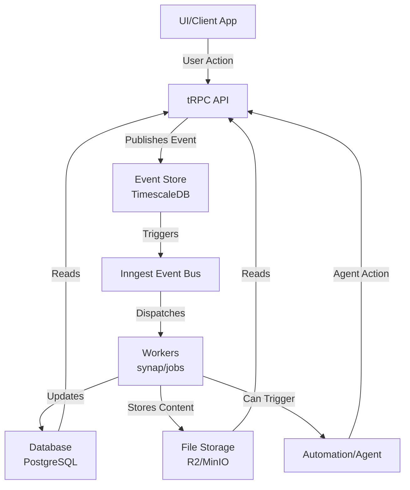
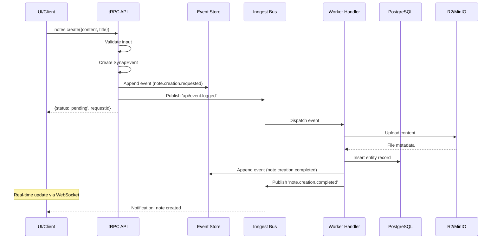

# Event-Driven Architecture

**Technical documentation for developers and architects**

---

## Design Philosophy

### Core Principles

1. **Event-Driven First**: Inngest is the central event bus - all communication goes through events
2. **CQRS Pattern**: Commands (writes) publish events, Queries (reads) access projections directly
3. **Event Sourcing**: TimescaleDB event store is the single source of truth (immutable history)
4. **Hybrid Storage**: PostgreSQL for metadata, R2/MinIO for content (strict separation)
5. **Type-Safe**: TypeScript strict mode + Zod runtime validation (SynapEvent schema)
6. **PostgreSQL-Only**: Unified database with TimescaleDB and pgvector extensions
7. **LLM-Agnostic**: Switch AI providers with configuration

---

## Complete Data Flow

### Architecture Overview

Synap Backend follows a **pure event-driven architecture** where all state changes flow through events. The complete flow is:

**UI or Automation (Agents) → Events → Workers → Data Layer (Database & File Storage)**

import Tabs from '@theme/Tabs';
import TabItem from '@theme/TabItem';
import MermaidFullscreen from '@site/src/components/MermaidFullscreen';

<Tabs>
<TabItem value="visual" label="Visual Schema" default>

<MermaidFullscreen 
  title="Event-Driven Architecture Overview"
  value={`graph TD
    A[UI/Client App] -->|User Action| B[tRPC API]
    C[Automation/Agent] -->|Agent Action| B
    B -->|Publishes Event| D[Event Store<br/>TimescaleDB]
    D -->|Triggers| E[Inngest Event Bus]
    E -->|Dispatches| F[Workers<br/>synap/jobs]
    F -->|Updates| G[Database<br/>PostgreSQL]
    F -->|Stores Content| H[File Storage<br/>R2/MinIO]
    F -->|Can Trigger| C
    G -->|Reads| B
    H -->|Reads| B`} 
/>

</TabItem>
<TabItem value="code" label="Mermaid Code">

````markdown

````

</TabItem>
</Tabs>

---

## Detailed Flow Breakdown

### 1. Entry Points: UI or Automation (Agents)

#### UI Entry Point
```typescript
// User creates a note via UI
User → App → @synap/client → tRPC API
```

#### Automation Entry Point (Agents)
```typescript
// Agent creates a note automatically
Agent (LangGraph) → Tool Execution → tRPC API
```

**Key Point**: Both UI and agents use the same API and publish the same events.

---

### 2. Event Creation

**Location**: `packages/api/src/routers/`

All mutations create events with optional **metadata** for context:

```typescript
// Example: Creating a note (user action)
const event = createSynapEvent({
  type: EventTypes.NOTE_CREATION_REQUESTED,
  userId,
  aggregateId: entityId,
  data: { content, title },
  source: 'api',
  // metadata is optional - used for AI, import, sync context
});

// Example: Creating an entity (AI extraction)
const event = createSynapEvent({
  type: EventTypes.ENTITY_CREATED,
  userId,
  aggregateId: entityId,
  data: { type: 'task', title: 'Call John' },
  source: 'intelligence',
  metadata: {
    ai: {
      agent: 'orchestrator',
      confidence: { score: 0.92 },
      extraction: {
        extractedFrom: { messageId: 'msg_123', threadId: 'thread_456' },
        method: 'explicit',
      },
    },
  },
});

// Append to Event Store (PostgreSQL/TimescaleDB)
await eventRepo.append(event);

// Publish to Inngest for async processing
await publishEvent('api/event.logged', eventData);
```

**Event Store**: PostgreSQL with optional TimescaleDB hypertable for immutable event history.

:::tip Metadata Extensibility
The `metadata` field is the key extensibility point. See [Event Metadata](./event-metadata.md) for details on AI, import, sync, and custom metadata.
:::

---

### 3. Event Bus (Inngest)

**Location**: `packages/jobs/src/functions/event-dispatcher.ts`

Inngest receives events and dispatches them to registered handlers:

```typescript
export const eventDispatcher = inngest.createFunction(
  { id: 'event-dispatcher' },
  { event: 'api/event.logged' },
  async ({ event, step }) => {
    const synapEvent = event.data;
    
    // Route to appropriate handler
    const handler = getHandler(synapEvent.type);
    if (handler) {
      await handler.handle(synapEvent);
    }
  }
);
```

**Features**:
- Automatic retries on failure
- Event filtering
- Handler registration
- Async processing

---

### 4. Workers (Event Handlers)

**Location**: `packages/jobs/src/handlers/`

Workers implement `IEventHandler` and process events:

```typescript
export class NoteCreationHandler implements IEventHandler {
  eventType = EventTypes.NOTE_CREATION_REQUESTED;

  async handle(event: SynapEvent, step: InngestStep): Promise<HandlerResult> {
    // Step 1: Upload content to storage
    const fileMetadata = await step.run('upload-to-storage', async () => {
      const storagePath = storage.buildPath(userId, 'note', entityId, 'md');
      return await storage.upload(storagePath, content);
    });

    // Step 2: Create entity in database projection
    await step.run('create-entity-projection', async () => {
      await db.insert(entities).values({
        id: entityId,
        userId,
        type: 'note',
        title,
        filePath: fileMetadata.path,
      });
    });

    // Step 3: Publish completion event
    await publishEvent('note.creation.completed', { entityId });
  }
}
```

**Key Responsibilities**:
- Execute business logic
- Update database projections
- Store content in file storage
- Publish new events (if needed)

---

### 5. Data Layer

#### Database (PostgreSQL)
- **Metadata**: Entities, tags, relations, etc.
- **Event Store**: Immutable event history (TimescaleDB)
- **Vector Store**: Embeddings for semantic search (pgvector)

#### File Storage (R2/MinIO)
- **Content**: Note content, file attachments, etc.
- **Path Structure**: `{userId}/{entityType}/{entityId}.{ext}`

---

## Complete Example: Note Creation Flow

### Step-by-Step Flow

<Tabs>
<TabItem value="visual" label="Visual Schema" default>

<MermaidFullscreen 
  title="Note Creation Flow"
  value={`sequenceDiagram
    participant UI as UI/Client
    participant API as tRPC API
    participant Store as Event Store
    participant Bus as Inngest Bus
    participant Worker as Worker Handler
    participant DB as PostgreSQL
    participant Storage as R2/MinIO

    UI->>API: notes.create({content, title})
    API->>API: Validate input
    API->>API: Create SynapEvent
    API->>Store: Append event (note.creation.requested)
    API->>Bus: Publish 'api/event.logged'
    API-->>UI: {status: 'pending', requestId}
    
    Bus->>Worker: Dispatch event
    Worker->>Storage: Upload content
    Storage-->>Worker: File metadata
    Worker->>DB: Insert entity record
    Worker->>Store: Append event (note.creation.completed)
    Worker->>Bus: Publish 'note.creation.completed'
    
    Note over UI: Real-time update via WebSocket
    Bus-->>UI: Notification: note created`} 
/>

</TabItem>
<TabItem value="code" label="Mermaid Code">

````markdown

````

</TabItem>
</Tabs>

### Code Flow

1. **UI/Agent** → Calls `notes.create` via tRPC
2. **API Router** → Validates, creates event, publishes to Inngest
3. **Event Store** → Event appended to TimescaleDB (immutable)
4. **Inngest** → Dispatches to registered handler
5. **Worker** → Processes event:
   - Uploads content to storage
   - Creates entity in database
   - Publishes completion event
6. **Data Layer** → Updated (database + storage)
7. **Real-time** → UI notified via WebSocket

---

## Agent Integration

### How Agents Fit In

Agents (LangGraph workflows) can:
- **Read** from database/storage (queries)
- **Create** events via API (same as UI)
- **Be triggered** by events (via workers)

```typescript
// Agent tool that creates an entity
export const createEntityTool = {
  name: 'createEntity',
  execute: async (input, context) => {
    // Agent calls the same API as UI
    const result = await apiClient.notes.create.mutate({
      content: input.content,
      title: input.title,
    });
    return result;
  },
};
```

**Key Point**: Agents use the same event-driven flow as UI actions.

---

## Best Practices

1. **Always publish events for state changes** - Never update projections directly from API
2. **Use projections for reads** - Fast queries from materialized views
3. **Keep handlers idempotent** - Events can be reprocessed
4. **Validate events with Zod** - Type safety at runtime
5. **Log all events** - Full audit trail
6. **Use Inngest for async work** - Never block API responses
7. **Agents follow same pattern** - Use API to create events, not direct DB access

---

## Benefits

### Scalability
- Horizontal scaling of workers
- Event bus handles load distribution
- No database bottlenecks

### Reliability
- Automatic retries
- Event replay capability
- Full audit trail

### Maintainability
- Clear separation of concerns
- Easy to add new handlers
- Type-safe event schemas
- Agents and UI use same patterns

---

**Next**: See [AI Architecture](./ai-architecture.md) for agent implementation details.
