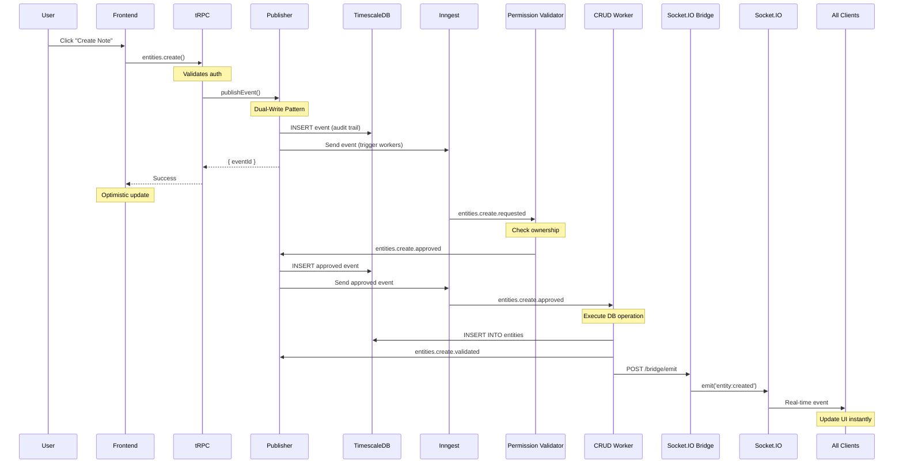

# Event Flow

**Complete end-to-end flow from user action to frontend update**

---

## Overview

This diagram shows the **complete production event flow** in Synap, from user clicking a button to real-time updates across all connected clients.

---

## Complete Flow Diagram



---

## Step-by-Step Breakdown

### Phase 1: User Intent (< 50ms)

**User clicks "Create Note" in UI**

```typescript
// Frontend
await client.entities.create({
  type: 'note',
  title: 'Meeting Notes'
});

// Returns immediately with:
{ eventId: 'evt_abc123' }
```

**What happens:**
1. tRPC validates authentication
2. `publishEvent()` dual-writes:
   - TimescaleDB ← Permanent audit trail
   - Inngest ← Trigger workers
3. Returns to user (non-blocking)

---

### Phase 2: Permission Check (< 100ms)

**permissionValidator worker processes event**

```typescript
// Automatic - triggered by Inngest
if (user === owner && action === 'create') {
  await publishEvent({
    type: 'entities.create.approved',
    data: {...}
  });
}
```

**Outcomes:**
- ✅ **Approved** → Emit `.approved` event
- ❌ **Rejected** → Emit `.rejected` event (stops here)
- ⏸️ **Pending** → Store for user approval (AI proposals)

---

### Phase 3: Execution (< 200ms)

**entitiesWorker creates the entity**

```typescript
// Listens to .approved events
await db.insert(entities).values({
  id: entityId,
  userId,
  type: 'note',
  title: 'Meeting Notes',
  ...
});

await publishEvent({
  type: 'entities.create.validated',
  data: { entityId }
});

// NEW: Real-time update
await fetch('http://localhost:3001/bridge/emit', {
  method: 'POST',
  body: JSON.stringify({
    event: 'entity:created',
    workspaceId: 'workspace-123',
    data: { entityId, title: 'Meeting Notes' }
  })
});
```

---

### Phase 4: Real-Time Update (< 50ms)

**Socket.IO bridge broadcasts to all clients**

```typescript
// Socket.IO bridge
io.of('/presence')
  .to(`workspace:${workspaceId}`)
  .emit('entity:created', {
    entityId,
    title: 'Meeting Notes',
    userId
  });
```

**All connected clients receive update:**
- TanStack Query cache invalidates
- UI re-renders with new entity
- Users see change instantly

---

## Total Latency

| Phase | Operation | Time |
|-------|-----------|------|
| 1 | API → publishEvent → Return | ~50ms |
| 2 | Permission validation | ~100ms |
| 3 | DB operation + validated event | ~200ms |
| 4 | Real-time broadcast | ~50ms |
| **Total** | **User click → All clients updated** | **~400ms** |

**Note:** User sees optimistic update immediately (~50ms), then confirmation after validation (~400ms).

---

## Event Audit Trail

After this flow completes, TimescaleDB contains:

```sql
SELECT type, timestamp, user_id, data
FROM events_timescale
WHERE subject_id = 'note_123'
ORDER BY timestamp;
```

**Results:**
```
entities.create.requested  | 2024-12-26 14:45:00.100 | alice | {...}
entities.create.approved   | 2024-12-26 14:45:00.200 | alice | {...}
entities.create.validated  | 2024-12-26 14:45:00.400 | alice | {...}
```

**Complete history preserved forever** ✨

---

## Error Handling

### If Permission Check Fails

```
User → tRPC → publishEvent() → Inngest
                ↓
        permissionValidator
                ↓
        NOT OWNER → REJECT
                ↓
        No .approved event
                ↓
        Worker never triggers
                ↓
        Entity not created ✅
```

### If Inngest Fails

```
publishEvent() tries:
  1. Write to TimescaleDB ✅
  2. Send to Inngest ❌ (fails)
  3. Mark event as inngest_pending: true
  4. Background job retries later
```

Event is never lost, even if workers are down.

---

## Comparison with Traditional

| Aspect | Traditional API | Synap Event Flow |
|--------|----------------|------------------|
| **Permission Check** | In API route | In worker |
| **Audit Trail** | Manual logging | Automatic (events) |
| **Real-time Updates** | Polling/webhooks | Socket.IO |
| **AI Approval** | Hard to implement | Built-in |
| **Fault Tolerance** | Partial state risk | Event log + retries |
| **Latency** | ~100ms | ~400ms (with audit) |

---

## Next Steps

- [Permission Model](./permission-model) - Authorization details
- [Core Patterns](./core-patterns) - Architecture patterns
- [Event Catalog](../reference/event-catalog) - All event types
