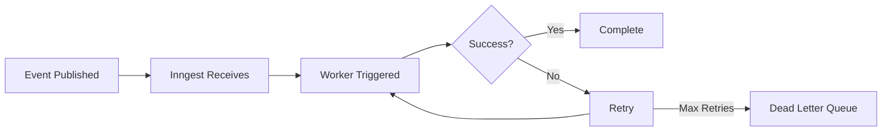

# Automation & Workers System

**Deep dive into Synap's event-driven automation**

---

## Overview

Workers are **event handlers** that process events and execute business logic. Every state change in Synap flows through workers, making them the core of the automation system.

**Architecture**: Events → Inngest → Workers → Database + Side Effects

---

## What is a Worker?

A worker is a function that:
1. **Listens** to specific event types
2. **Processes** the event data
3. **Executes** business logic (DB writes, file operations, AI calls)
4. **Publishes** new events (if needed)

### Worker Lifecycle



---

## Default Workers

Synap includes **7 default workers** that handle core functionality:

### 1. Entities Worker

**Triggers**: 
- `entities.create.requested`
- `entities.update.requested`
- `entities.delete.requested`

**Purpose**: Manage entity lifecycle (notes, tasks, projects)

**Actions**:
```typescript
// On create.requested
1. Validate entity data
2. Upload content to file storage
3. Create entity record in database
4. Publish entities.create.validated

// On update.requested
1. Validate changes
2. Update entity in database
3. If content changed: upload new version
4. Publish entities.update.validated

// On delete.requested
1. Soft-delete entity (set deleted_at)
2. Preserve in event store (audit trail)
3. Publish entities.delete.validated
```

**Location**: `packages/jobs/src/functions/entities.ts`

---

### 2. Documents Worker

**Triggers**:
- `documents.create.requested`
- `documents.update.requested`
- `documents.delete.requested`

**Purpose**: Handle document storage and versioning

**Actions**:
```typescript
// On create.requested
1. Upload document to storage
2. Create document metadata record
3. Generate preview/thumbnail (if applicable)
4. Publish documents.create.validated

// On update.requested
1. Create new documentVersion record
2. Store delta (changes only, not full content)
3. Upload new version to storage
4. Update document.currentVersion
5. Publish documents.update.validated

// On delete.requested
1. Soft-delete document
2. Preserve all versions (audit trail)
3. Publish documents.delete.validated
```

**Location**: `packages/jobs/src/functions/documents.ts`

**Key Feature**: **Automatic versioning** - every document update creates a new version

---

### 3. Messages Worker

**Triggers**:
- `conversationMessages.create.requested`
- `conversationMessages.update.requested`

**Purpose**: Process chat messages and maintain threading

**Actions**:
```typescript
// On create.requested
1. Validate message content
2. Assign to thread (or create new thread)
3. Store message in database
4. Trigger AI analysis (if enabled)
5. Publish conversationMessages.create.validated

// On update.requested
1. Create edit history
2. Update message content
3. Publish conversationMessages.update.validated
```

**Location**: `packages/jobs/src/functions/messages.ts`

---

### 4. AI Analyzer Worker

**Triggers**:
- `entities.create.validated`
- `entities.update.validated`

**Purpose**: Generate embeddings and AI metadata

**Actions**:
```typescript
// On entities.create.validated
1. Extract content from entity
2. Generate vector embeddings (OpenAI/local model)
3. Store in entity_vectors table
4. Extract tags/metadata (if AI enabled)
5. Store AI metadata

// On entities.update.validated
1. Check if content changed
2. If yes: regenerate embeddings
3. Update vectors
```

**Location**: `packages/jobs/src/functions/ai-analyzer.ts`

**Performance**: Uses background jobs - doesn't block user actions

---

### 5. Insight Detector Worker

**Triggers**:
- `entities.create.validated`
- `entities.update.validated`
- `conversationMessages.create.validated`

**Purpose**: Detect patterns and generate AI suggestions

**Actions**:
```typescript
// Pattern detection
1. Analyze entity/message content
2. Compare with existing knowledge graph
3. Detect:
   - Duplicate entities
   - Related entities (should be linked)
   - Missing tags
   - Action items (tasks)
4. Create AI suggestions for user review
5. Store in ai_suggestions table
```

**Location**: `packages/jobs/src/functions/insight-detector.ts`

**User Experience**: Suggestions appear in UI as notifications

---

### 6. Embedding Worker

**Triggers**:
- `entities.create.validated`

**Purpose**: Semantic search enablement

**Actions**:
```typescript
// Generate embeddings
1. Extract text content
2. Call embedding model (OpenAI text-embedding-3-small)
3. Store 1536-dimension vector
4. Enable semantic search via pgvector
```

**Location**: `packages/jobs/src/functions/embeddings.ts`

**Storage**: PostgreSQL with pgvector extension

---

### 7. Webhook Broker Worker

**Triggers**: **Any event** (if webhook subscription exists)

**Purpose**: Deliver events to external systems

**Actions**:
```typescript
// Event delivery
1. Check webhook subscriptions for this event type
2. For each subscription:
   a. Build webhook payload
   b. Sign with HMAC (if secret configured)
   c. POST to subscriber URL
   d. Retry on failure (3 attempts, exponential backoff)
   e. Log delivery status
```

**Location**: `packages/jobs/src/functions/webhook-broker.ts`

**Reliability**: Guaranteed delivery with retries

---

## Default Automations

### Document Versioning

**Trigger**: `documents.update.requested`

**Flow**:
```
User edits document
  → documents.update.requested
  → Documents Worker creates new version
  → Stores delta (diff)
  → documents.update.validated
  → User sees new version in history
```

**Result**: Full version history, time-travel capability

---

### Message Threading

**Trigger**: `conversationMessages.create.requested`

**Flow**:
```
User sends message
  → conversationMessages.create.requested
  → Messages Worker assigns to thread
  → Creates thread if new conversation
  → conversationMessages.create.validated
  → Message appears in chat
```

**Result**: Organized conversation history

---

### Entity File Storage

**Trigger**: `entities.create.requested`

**Flow**:
```
User creates note with content
  → entities.create.requested
  → Entities Worker:
      • Uploads content to R2/MinIO
      • Stores metadata in PostgreSQL
      • Links: entity.id ↔ file.path
  → entities.create.validated
  → User accesses via API
```

**Storage Path**: `{userId}/{entityType}/{entityId}.{ext}`

---

### Semantic Search

**Trigger**: `entities.create.validated`

**Flow**:
```
Entity created
  → entities.create.validated
  → Embedding Worker generates vectors
  → Stores in entity_vectors
  → Enables search.byVector(query)
```

**Search**: Powered by pgvector cosine similarity

---

## Creating Custom Workers

### 1. Define Worker Function

```typescript
// packages/jobs/src/functions/my-custom-worker.ts
import { inngest } from '../inngest';

export const myCustomWorker = inngest.createFunction(
  {
    id: 'my-custom-worker',
    name: 'My Custom Worker',
  },
  {
    event: 'entities.create.validated',
  },
  async ({ event, step }) => {
    // Step 1: Extract data
    const { entityId, type } = event.data;
    
    // Step 2: Process
    const result = await step.run('process-entity', async () => {
      return await processEntity(entityId);
    });
    
    // Step 3: Store result
    await step.run('store-result', async () => {
      await db.insert(myTable).values({
        entityId,
        result: result.data,
      });
    });
    
    return { success: true };
  }
);
```

### 2. Register Worker

```typescript
// packages/jobs/src/index.ts
export const functions = [
  // Existing workers
  entitiesWorker,
  documentsWorker,
  // ... other workers
  
  // Your custom worker
  myCustomWorker,
];
```

### 3. Deploy

```bash
# Build packages
pnpm run build

# Workers automatically deployed via Inngest
```

---

## Worker Best Practices

### 1. Idempotency

Workers should be **idempotent** - running multiple times produces same result:

```typescript
// ✅ Good - Check if already processed
await step.run('create-entity', async () => {
  const existing = await db.query.entities.findFirst({
    where: eq(entities.id, entityId),
  });
  
  if (existing) {
    return existing; // Already exists, skip
  }
  
  return await db.insert(entities).values({ ... });
});

// ❌ Bad - Always creates new record
await db.insert(entities).values({ ... });
```

### 2. Use Steps for Retries

```typescript
// ✅ Good - Each step can retry independently
await step.run('upload-file', async () => {...});
await step.run('create-record', async () => {...});

// ❌ Bad - All-or-nothing
await uploadFile();
await createRecord();
```

### 3. Validate Event Data

```typescript
// ✅ Good - Validate with Zod
const data = EventTypeSchemas['entities.create.requested'].parse(event.data);

// ❌ Bad - Assume data is correct
const { title, content } = event.data;
```

### 4. Handle Errors Gracefully

```typescript
// ✅ Good - Catch and log errors
try {
  await step.run('risky-operation', async () => {
    return await externalAPI.call();
  });
} catch (error) {
  logger.error({ error, eventId: event.id }, 'Operation failed');
  // Inngest will retry automatically
  throw error;
}
```

---

## Monitoring Workers

### Check Worker Status

```bash
# Via Inngest Dev Server
open http://localhost:8288

# Via API
curl http://localhost:3000/trpc/system.getCapabilities
```

### Worker Metrics

- **Success Rate**: % of events processed successfully
- **Retry Rate**: % of events that required retries
- **Average Duration**: Time to process event
- **Error Rate**: % of events that failed after all retries

---

## Error Handling

### Automatic Retries

Inngest automatically retries failed workers:

| Attempt | Delay |
|---------|-------|
| 1 | 0s |
| 2 | 1s |
| 3 | 4s |
| 4 | 16s |
| ... | Exponential backoff |

**Max Retries**: 5 (configurable per worker)

---

### Dead Letter Queue

After max retries, failed events go to **Dead Letter Queue**:

```typescript
// Query failed events
const failedEvents = await inngest.getFailedRuns({
  functionId: 'entities-worker',
  limit: 100,
});

// Retry manually
await inngest.retryRun(failedEvents[0].id);
```

---

## Performance Optimization

### 1. Batch Processing

```typescript
// ✅ Good - Batch operations
await step.run('process-batch', async () => {
  const entities = await fetchEntities();
  return await db.insert(myTable).values(entities);
});

// ❌ Bad - One at a time
for (const entity of entities) {
  await step.run('process-one', async () => {...});
}
```

### 2. Parallel Steps

```typescript
// ✅ Good - Run in parallel
const [embeddings, tags] = await Promise.all([
  step.run('generate-embeddings', async () => {...}),
  step.run('extract-tags', async () => {...}),
]);
```

### 3. Caching

```typescript
// Cache expensive operations
const cached = await step.run('get-or-compute', async () => {
  const existing = await cache.get(key);
  if (existing) return existing;
  
  const result = await expensiveOperation();
  await cache.set(key, result, { ttl: 3600 });
  return result;
});
```

---

## Next Steps

- [Event Architecture](./event-architecture.md) - Event pattern reference
- [Event Types Catalog](../../api/event-types-catalog.md) - All events + workers
- [Webhooks Guide](../../integrations/webhooks-guide.md) - External automations
