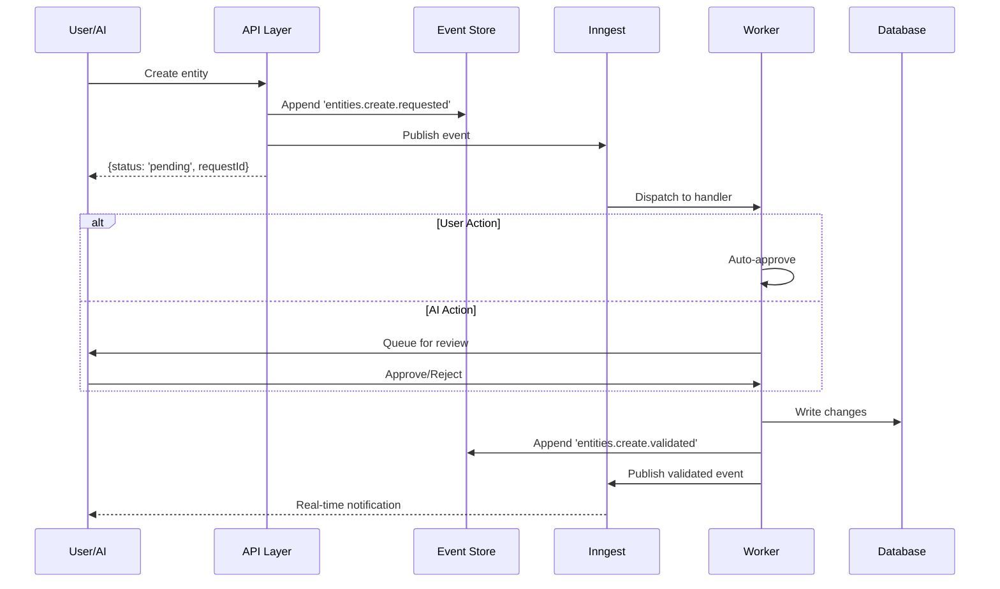

# Event Architecture

**Understanding Synap's event-driven foundation**

---

## Overview

Synap uses a **schema-driven event sourcing architecture** where all state changes flow through a standardized event pattern. This architecture enables:

- ✅ **User control over AI actions** - Approve or reject AI-proposed changes
- ✅ **Complete audit trail** - Every change is tracked
- ✅ **Granular permissions** - Control what each AI agent can do
- ✅ **External integrations** - Connect via webhooks to any system
- ✅ **Data sovereignty** - Your data pod, your approval rules

---

## The Pattern

### Core Structure

Every event in Synap follows this pattern:

```
{table}.{action}.{modifier}
```

- **table**: Database table (e.g., `entities`, `documents`, `chatThreads`)
- **action**: CRUD operation (`create`, `update`, `delete`)
- **modifier**: Flow stage (`requested`, `validated`)

### Example Events

```typescript
// Entity creation
'entities.create.requested'   // Intent: User or AI wants to create
'entities.create.validated'   // Execution: Change confirmed and applied

// Document update
'documents.update.requested'  // Intent: Update proposed
'documents.update.validated'  // Execution: Update confirmed

// Entity deletion
'entities.delete.requested'   // Intent: Delete proposed
'entities.delete.validated'   // Execution: Delete confirmed
```

---

## Why Two Stages?

### The Problem

Traditional systems have a binary choice:
- **Allow**: AI/external system can do anything
- **Deny**: AI/external system can do nothing

### The Solution: Requested → Validated Flow

```
┌──────────────┐
│ User or AI   │
│ submits      │
└──────┬───────┘
       │
       ▼
┌─────────────────────┐
│ .requested          │◄─── Intent logged
│ (can always submit) │
└──────┬──────────────┘
       │
       ▼
  ┌────────────┐
  │  Approval  │──► User approval (for AI)
  │   Check    │    Auto-approve (for user)
  └─────┬──────┘    Policy check
        │
        ▼
┌─────────────────────┐
│ .validated          │◄─── Change executed
│ (only after OK)     │
└─────────────────────┘
```

### Benefits

| Actor | Behavior |
|-------|----------|
| **User** | Requested → Instant validation → Change applied |
| **AI Agent** | Requested → Queue for review → User approves → Validated |
| **External API** | Requested → Policy check → Auto or manual approval |

---

## Generated Event Types

Events are **automatically generated** from database tables. No manual event definitions needed.

### Core Tables

```typescript
// packages/events/src/generator.ts
export const CORE_TABLES = [
  'entities',              // Knowledge graph nodes
  'documents',             // User documents
  'documentVersions',      // Document history
  'chatThreads',           // Chat conversations
  'conversationMessages',  // Chat messages
  'webhookSubscriptions',  // Webhook config
  'apiKeys',               // API key management
  'tags',                  // User-defined labels
  'agents',                // AI agent configs
] as const;
```

### Automatic Generation

Each table generates 6 events:

```typescript
// For each table, you get:
{table}.create.requested
{table}.create.validated
{table}.update.requested
{table}.update.validated
{table}.delete.requested
{table}.delete.validated

// Example for 'entities' table:
GeneratedEventTypes.entities['create.requested']
GeneratedEventTypes.entities['create.validated']
// ... (6 events total)
```

**Total**: 9 tables × 6 events = **54 generated event types**

---

## System Events

For cross-cutting operations that don't map to specific tables:

```typescript
// packages/types/src/event-types.ts
export const SystemEventTypes = {
  WEBHOOK_DELIVERY: 'webhooks.deliver.requested',
} as const;
```

**Total events**: 54 generated + 1 system = **55 event types**

---

## Complete Flow

import Tabs from '@theme/Tabs';
import TabItem from '@theme/TabItem';
import MermaidFullscreen from '@site/src/components/MermaidFullscreen';

<Tabs>
<TabItem value="visual" label="Visual Flow" default>

<MermaidFullscreen 
  title="Event Flow: Requested → Validated"
  value={`sequenceDiagram
    participant User as User/AI
    participant API as API Layer
    participant Store as Event Store
    participant Bus as Inngest
    participant Worker as Worker
    participant DB as Database
    
    User->>API: Create entity
    API->>Store: Append 'entities.create.requested'
    API->>Bus: Publish event
    API-->>User: {status: 'pending', requestId}
    
    Bus->>Worker: Dispatch to handler
    
    alt User Action
        Worker->>Worker: Auto-approve
    else AI Action
        Worker->>User: Queue for review
        User->>Worker: Approve/Reject
    end
    
    Worker->>DB: Write changes
    Worker->>Store: Append 'entities.create.validated'
    Worker->>Bus: Publish validated event
    Bus-->>User: Real-time notification`} 
/>

</TabItem>
<TabItem value="code" label="Mermaid Code">

````markdown

````

</TabItem>
</Tabs>

---

## Usage Examples

### Publishing Events

```typescript
import { createSynapEvent, GeneratedEventTypes } from '@synap/types';
import { publishEvent } from '@synap/events';

// User creates an entity
const event = createSynapEvent({
  type: GeneratedEventTypes.entities['create.requested'],
  userId: 'user-123',
  data: {
    type: 'note',
    title: 'Meeting Notes',
    content: 'Discussed Q1 roadmap...',
  },
  source: 'api',
});

await publishEvent('api/event.logged', event);
```

### Subscribing to Events

```typescript
import { inngest } from './inngest';

// Worker that processes validated entities
export const entityCreatedHandler = inngest.createFunction(
  { id: 'entity-created' },
  { event: 'entities.create.validated' },
  async ({ event }) => {
    const { entityId, type } = event.data;
    
    // Process the validated entity
    await processEntity(entityId, type);
  }
);
```

---

## Extension Points

### Adding New Tables

1. Add to `CORE_TABLES`:
```typescript
// packages/events/src/generator.ts
export const CORE_TABLES = [
  'entities',
  'documents',
  'myNewTable',  // Add here
] as const;
```

2. Events auto-generate:
```typescript
myNewTable.create.requested
myNewTable.create.validated
myNewTable.update.requested
myNewTable.update.validated
myNewTable.delete.requested
myNewTable.delete.validated
```

### Custom Validation Logic

```typescript
// Implement custom approval workflow
inngest.createFunction(
  { id: 'ai-approval-workflow' },
  { event: 'entities.create.requested' },
  async ({ event }) => {
    const { source, data } = event.data;
    
    if (source === 'ai-agent') {
      // Check permissions
      const canAutoApprove = await checkAIPermissions(
        event.userId,
        data.aiAgent
      );
      
      if (canAutoApprove) {
        // Auto-approve
        await publishValidatedEvent(event);
      } else {
        // Queue for manual review
        await queueForUserReview(event);
      }
    } else {
      // User action: auto-approve
      await publishValidatedEvent(event);
    }
  }
);
```

---

## Best Practices

### 1. Always Use Generated Types

```typescript
// ✅ Good - Type-safe
type: GeneratedEventTypes.entities['create.requested']

// ❌ Bad - Hard-coded string
type: 'entities.create.requested'
```

### 2. Validate at Boundaries

```typescript
import { isGeneratedEventType } from '@synap/events';

if (!isGeneratedEventType(eventType)) {
  throw new Error(`Unknown event type: ${eventType}`);
}
```

### 3. Keep Events Immutable

```typescript
// ✅ Good - Event store is append-only
await eventRepository.append(event);

// ❌ Bad - Never update events
await eventRepository.update(event);  // This doesn't exist
```

---

## Monitoring

### Check Event Counts

```bash
curl http://localhost:3000/trpc/system.getCapabilities

# Response
{
  "eventTypes": 55,
  "workers": 7
}
```

---

## Next Steps

- [Automation System](./automation-system.md) - Deep dive on workers
- [Event Types Catalog](../../api/event-types-catalog.md) - All 55 events
- [Business: AI Control](../../getting-started/why-events.md) - Why this matters
- [Webhooks Guide](../../integrations/webhooks-guide.md) - External integrations
