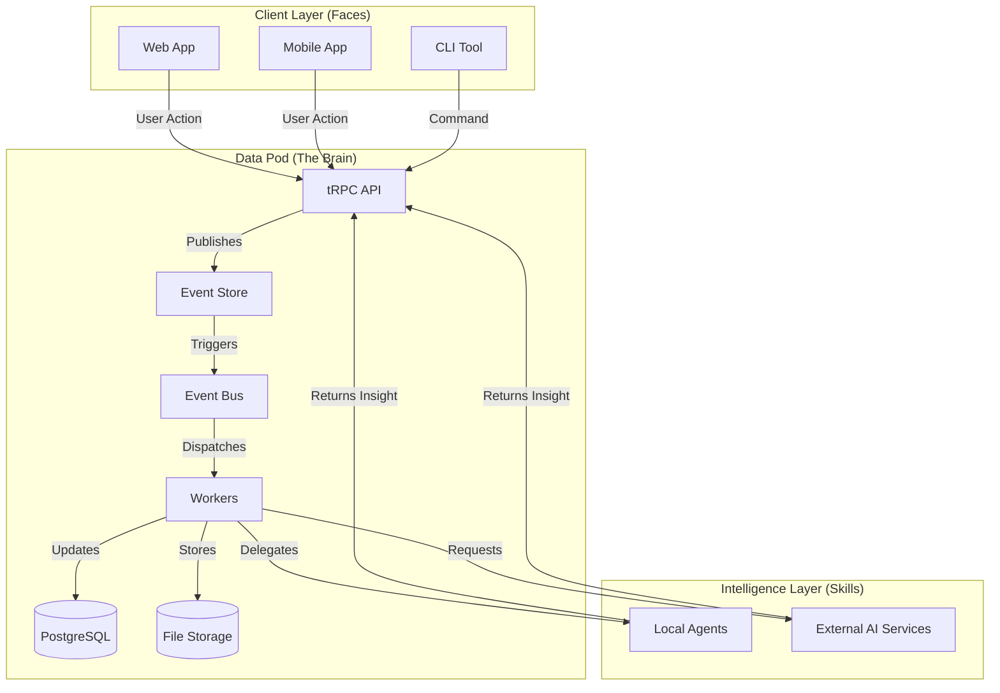

# Architecture Overview

**Complete architecture of the Synap Backend ecosystem**

---

## High-Level Architecture

Synap follows a **pure event-driven architecture** where all state changes flow through events:

**UI or Automation (Agents) →Events → Workers → Data Layer (Database & File Storage)**

> [!NOTE]
> **External Services** in the diagram represent remote plugins that authenticate with the Data Pod via the Hub Protocol. These are plugins hosted externally that extend Data Pod functionality.

import Tabs from '@theme/Tabs';
import TabItem from '@theme/TabItem';
import MermaidFullscreen from '@site/src/components/MermaidFullscreen';

<Tabs>
<TabItem value="visual" label="Visual Schema" default>

<MermaidFullscreen 
  title="High-Level Architecture"
  value={`graph TD
    subgraph Client ["Client Layer (Faces)"]
      Web[Web App]
      Mobile[Mobile App]
      CLI[CLI Tool]
    end

    subgraph Core ["Data Pod (The Brain)"]
      API[tRPC API]
      Store[Event Store]
      Bus[Event Bus]
      Worker[Workers]
      DB[(PostgreSQL)]
      File[(File Storage)]
    end

    subgraph Intelligence ["Intelligence Layer (Skills)"]
      Agent[Local Agents]
      External[External AI Services]
    end

    %% Client Interactions
    Web -->|User Action| API
    Mobile -->|User Action| API
    CLI -->|Command| API

    %% Core Flow
    API -->|Publishes| Store
    Store -->|Triggers| Bus
    Bus -->|Dispatches| Worker
    Worker -->|Updates| DB
    Worker -->|Stores| File

    %% Intelligence Interactions
    Worker -->|Delegates| Agent
    Worker -->|Requests| External
    Agent -->|Returns Insight| API
    External -->|Returns Insight| API`} 
/>

</TabItem>
<TabItem value="code" label="Mermaid Code">

````markdown

````

</TabItem>
</Tabs>

---

## Complete User Flow

### Simple Flow: Creating a Note

<Tabs>
<TabItem value="visual" label="Visual Schema" default>

<MermaidFullscreen 
  title="Simple Flow: Creating a Note"
  value={`sequenceDiagram
    actor User
    participant UI as Client App
    participant API as tRPC API
    participant Store as Event Store
    participant Bus as Inngest
    participant Worker as Worker Handler
    participant DB as PostgreSQL
    participant Storage as R2/MinIO

    User->>UI: Create note
    UI->>API: notes.create({content, title})
    API->>API: Validate & Create SynapEvent
    API->>Store: Append event (note.creation.requested)
    API->>Bus: Publish 'api/event.logged'
    API-->>UI: {status: 'pending', requestId}
    
    Bus->>Worker: Dispatch event
    Worker->>Storage: Upload content
    Storage-->>Worker: File metadata
    Worker->>DB: Insert entity record
    Worker->>Store: Append event (note.creation.completed)
    Worker->>Bus: Publish 'note.creation.completed'
    
    Bus-->>UI: Real-time notification
    UI->>User: Note created`} 
/>

</TabItem>
<TabItem value="code" label="Mermaid Code">

````markdown

````

</TabItem>
</Tabs>

### Complex Flow: AI-Powered Request with External Service

<Tabs>
<TabItem value="visual" label="Visual Schema" default>

<MermaidFullscreen 
  title="Complex Flow: AI-Powered Request with External Service"
  value={`sequenceDiagram
    actor User
    participant UI as Client App
    participant API as tRPC API
    participant Agent as Local Agent
    participant Service as External Service
    participant Store as Event Store
    participant Worker as Worker Handler
    participant DB as PostgreSQL

    User->>UI: "Plan my trip to Lisbon"
    UI->>API: chat.sendMessage()
    API->>Agent: Analyze intent
    Agent->>Agent: Determines need for external service
    
    Agent->>Service: requestExpertise()
    Service->>API: generateAccessToken()
    API-->>Service: JWT token
    Service->>API: requestData()
    API-->>Service: User data (read-only)
    Service->>Service: Process with AI
    Service->>API: submitInsight()
    
    API->>API: Transform insight → events
    API->>Store: Append events (project.creation.requested, task.creation.requested)
    API->>Bus: Publish events
    Bus->>Worker: Dispatch events
    Worker->>DB: Create project & tasks
    Worker->>Store: Append completion events
    
    API-->>UI: Real-time notification
    UI->>User: Trip plan ready`} 
/>

</TabItem>
<TabItem value="code" label="Mermaid Code">

````markdown

````

</TabItem>
</Tabs>

---

## Core Components

### Data Pod (Core OS)
- **Event Store**: Immutable event log (TimescaleDB)
- **Projections**: Materialized views for fast reads
- **tRPC APIs**: Type-safe APIs
- **Authentication**: Ory Kratos + Hydra
- **Storage**: R2/MinIO for file storage
- **Local Agents**: LangGraph workflows for basic tasks

### Intelligence (Plugins & Services)
- **Agent Plugins**: LangGraph-powered agents (single or multi-agent graphs)
- **External Services**: Specialized AI services via Hub Protocol (marketplace)
- **Tool Registry**: Dynamic tool registration for extensibility

### Client SDK
- **TypeScript SDK**: `@synap/client`
- **React Integration**: Hooks and components
- **Real-time**: WebSocket support

---

## Key Concepts

- **[Event Sourcing & CQRS](./core-patterns.md)** - Events as source of truth
- **[Hub & Spoke Model](../concepts/hub-and-spoke.md)** - Data Pod ↔ External Services
- **[Data Sovereignty](../concepts/data-sovereignty.md)** - Your data, your control
- **[Extensibility](../development/extending/overview.md)** - Plugin System & Extensions

---

## Technology Stack

- **Runtime**: Node.js 20+
- **Database**: PostgreSQL with TimescaleDB + pgvector
- **Event Bus**: Inngest
- **ORM**: Drizzle ORM
- **API**: tRPC + Hono
- **AI**: LangGraph + Vercel AI SDK
- **Auth**: Ory Stack (Kratos + Hydra)
- **Storage**: Cloudflare R2 / MinIO

---

## Next Steps

- **[Ecosystem Analysis](./ecosystem-analysis.md)** - Deep dive into all packages
- **[Core Patterns](./core-patterns.md)** - Event Sourcing, CQRS patterns
- **[Components](./components/data-pod.md)** - Learn about each component
