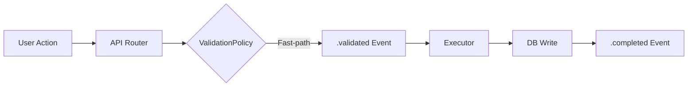
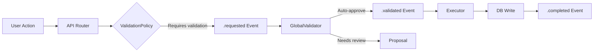

# Validation Policy System

**Flexible, workspace-configurable validation that balances security and speed**

---

## Overview

Synap uses a **smart validation policy system** that determines whether operations require human approval or can execute immediately. This gives you:

- 🔒 **Security by Default** - Sensitive operations require approval
- ⚡ **Speed Where Safe** - Common operations are instant
- 🎛️ **Workspace Control** - Customize policies per workspace
- 📊 **Full Auditability** - Every decision is logged

---

## The Problem

Traditional systems force you to choose:

| Approach | Security | User Experience |
|----------|----------|-----------------|
| **Too Permissive** | ❌ Anyone can do anything | ✅ Fast and easy |
| **Too Restrictive** | ✅ Everything approved | ❌ Slow and frustrating |

**Synap solves this** with smart defaults + workspace overrides.

---

## How It Works

### 1. Global Defaults

Every table has default validation rules:

| Table | Create | Update | Delete | Rationale |
|-------|--------|--------|--------|-----------|
| `entity` | ✅ Validate | ✅ Validate | ✅ Validate | Core data - requires approval |
| `conversation_message` | ⚡ Fast-path | ⚡ Fast-path | ✅ Validate | Chat is high-frequency |
| `chat_thread` | ⚡ Fast-path | ⚡ Fast-path | ✅ Validate | Thread creation is safe |
| `user_entity_state` | ⚡ Fast-path | ⚡ Fast-path | ⚡ Fast-path | Starring/pinning is safe |
| `agent` | ✅ Validate | ✅ Validate | ✅ Validate | AI agents need oversight |
| `proposal` | ⚡ Fast-path | ✅ Validate | ✅ Validate | System creates proposals |

**Legend**:
- ✅ **Validate**: Requires approval (3-phase event flow)
- ⚡ **Fast-path**: Executes immediately (1-phase event flow)

### 2. Workspace Overrides

Workspace owners can customize validation rules:

```typescript
// Example: Strict mode for enterprise
await client.workspaces.updateSettings({
  workspaceId: "ws-enterprise",
  settings: {
    validationRules: {
      conversation_message: {
        create: true,  // Override: require approval for messages
        update: true,
        delete: true
      },
      entity: {
        create: true,
        update: true,
        delete: true   // Keep default
      }
    }
  }
});
```

### 3. System Overrides

Some rules are **system-enforced** for security:

- **Deletions** generally require validation (prevent accidental data loss)
- **Exceptions**: `user_entity_state.delete` (unstar/unpin is reversible)

---

## Event Flows

### Fast-Path Flow (1 Phase)

For trusted operations like chat messages:



**Total Time**: ~50-100ms

```typescript
// Example: Send chat message
await client.messages.create({
  threadId: "thread-123",
  content: "Hello!"
});

// Events emitted:
// 1. conversation_message.create.validated ⚡
// 2. conversation_message.create.completed ✅
```

### Standard Flow (3 Phases)

For operations requiring approval:



**Total Time**: ~200-500ms (auto-approve) or ∞ (pending approval)

```typescript
// Example: Create entity
await client.entities.create({
  type: "note",
  title: "Meeting Notes"
});

// Events emitted:
// 1. entity.create.requested 📝
// 2. entity.create.validated ✅ (after permission check)
// 3. entity.create.completed ✅
```

---

## Configuration

### Workspace Settings API

```typescript
// Get current settings
const settings = await client.workspaces.getSettings({
  workspaceId: "ws-123"
});

// Update validation rules
await client.workspaces.updateSettings({
  workspaceId: "ws-123",
  settings: {
    validationRules: {
      chat_thread: {
        create: true  // Require approval for new threads
      },
      agent: {
        create: true,
        update: true,
        delete: true
      }
    }
  }
});

// Reset to defaults
await client.workspaces.resetSettings({
  workspaceId: "ws-123"
});
```

### AI Governance

Control AI behavior per workspace:

```typescript
{
  aiGovernance: {
    autoApprove: false,           // Require human review for AI
    requireReviewFor: [
      "agent.create",
      "enrichment.create"
    ],
    maxAgentsPerUser: 5,          // Limit AI agents
    allowAgentCreation: true      // Enable/disable feature
  }
}
```

### Role-Based Permissions

Fine-tune permissions per role:

```typescript
{
  rolePermissions: {
    editor: {
      entity: {
        create: true,
        read: true,
        update: true,
        delete: false  // Only admins can delete
      },
      agent: {
        create: false,  // Only admins can create agents
        read: true,
        update: false,
        delete: false
      }
    },
    viewer: {
      entity: {
        create: false,
        read: true,
        update: false,
        delete: false
      }
    }
  }
}
```

---

## Decision Logic

The ValidationPolicy service follows this logic:

```typescript
// Simplified decision flow
function shouldRequireValidation(table, operation, workspace) {
  // 1. Check system overrides (security rules)
  if (isSystemOverride(table, operation)) {
    return { requiresValidation: true, reason: "System security rule" };
  }
  
  // 2. Check workspace preferences
  if (workspace.settings?.validationRules?.[table]?.[operation] !== undefined) {
    return {
      requiresValidation: workspace.settings.validationRules[table][operation],
      reason: "Workspace preference",
      source: "workspace"
    };
  }
  
  // 3. Fall back to global defaults
  return {
    requiresValidation: GLOBAL_DEFAULTS[table][operation],
    reason: "Global default",
    source: "global"
  };
}
```

**All decisions are logged** for audit trail.

---

## Use Cases

### Startup Mode (Move Fast)

```typescript
{
  validationRules: {
    entity: { create: false, update: false, delete: true },
    agent: { create: false, update: false, delete: true },
    conversation_message: { create: false, update: false, delete: true }
  },
  aiGovernance: {
    autoApprove: true,
    maxAgentsPerUser: 10
  }
}
```

**Result**: Instant operations, AI freedom, deletions still protected

### Enterprise Mode (Stay Safe)

```typescript
{
  validationRules: {
    entity: { create: true, update: true, delete: true },
    agent: { create: true, update: true, delete: true },
    conversation_message: { create: true, update: true, delete: true }
  },
  aiGovernance: {
    autoApprove: false,
    requireReviewFor: ["agent.create", "enrichment.create"],
    maxAgentsPerUser: 3
  },
  rolePermissions: {
    editor: { entity: { delete: false } },
    viewer: { entity: { create: false, update: false, delete: false } }
  }
}
```

**Result**: Everything requires approval, strict AI governance, role-based restrictions

### Hybrid Mode (Balanced)

```typescript
{
  validationRules: {
    entity: { create: true, update: false, delete: true },
    conversation_message: { create: false, update: false, delete: true },
    agent: { create: true, update: true, delete: true }
  },
  aiGovernance: {
    autoApprove: false,
    maxAgentsPerUser: 5
  }
}
```

**Result**: Entity creation requires approval, chat is instant, AI controlled

---

## Benefits

### 1. Security Without Friction

- **Sensitive operations** (deletions, AI agents) require approval
- **Common operations** (chat, starring) are instant
- **Customizable** per workspace needs

### 2. Complete Auditability

Every validation decision is logged:

```sql
SELECT type, data, metadata
FROM events
WHERE type LIKE '%.requested'
  AND metadata->>'validationDecision' IS NOT NULL;
```

**Results show**:
- Which policy was applied
- Why (workspace override vs global default)
- Who made the decision
- When it happened

### 3. Governance at Scale

- **Workspace owners** control their team's policies
- **System admins** enforce security baselines
- **AI governance** prevents runaway automation
- **Role-based** permissions for fine-grained control

### 4. Flexibility

- **Start permissive**, tighten as you grow
- **Different policies** for different workspaces
- **Override defaults** without code changes
- **Experiment safely** with fast-path for testing

---

## Best Practices

### ✅ DO

- **Start with defaults** - They're designed for security + UX
- **Override selectively** - Only change what you need
- **Test in dev workspace** - Before applying to production
- **Monitor proposals** - Review what's being blocked
- **Use AI governance** - Control automation per workspace

### ❌ DON'T

- **Disable all validation** - Keep deletions protected
- **Override without reason** - Document why you changed defaults
- **Ignore proposals** - They're there for a reason
- **Skip role permissions** - Use RBAC for team control

---

## Debugging

### Check Validation Decision

```typescript
// The event metadata shows the decision
const event = await client.events.getById("evt-123");

console.log(event.metadata.validationDecision);
// {
//   requiresValidation: false,
//   reason: "Fast-path for conversation messages",
//   source: "global",
//   table: "conversation_message",
//   operation: "create"
// }
```

### View Workspace Settings

```typescript
const settings = await client.workspaces.getSettings({
  workspaceId: "ws-123"
});

console.log(settings.validationRules);
// Shows all custom rules
```

### Audit Trail

```sql
-- See all validation decisions for a workspace
SELECT 
  type,
  metadata->>'validationDecision' as decision,
  created_at
FROM events
WHERE workspace_id = 'ws-123'
  AND type LIKE '%.requested'
ORDER BY created_at DESC;
```

---

## Next Steps

- [Event Flow](./event-flow.md) - See validation in action
- [Permission Model](./permission-model.md) - Role-based access control
- [Workspace Management](../guides/workspace-management.md) - Configuration guide
- [AI Architecture](./ai-architecture.md) - AI governance integration

---

## FAQ

**Q: Can I disable validation entirely?**  
A: You can set most operations to fast-path, but deletions should stay protected. System overrides prevent disabling critical security rules.

**Q: What happens if I change a policy mid-operation?**  
A: New events use the new policy. In-flight events complete with the policy they started with.

**Q: Can users override workspace policies?**  
A: No. Workspace settings apply to all users. Only workspace owners/admins can change policies.

**Q: How do I know which policy is active?**  
A: Check `event.metadata.validationDecision` - it shows the source (global/workspace/system) and reason.

**Q: Can I have different policies per project?**  
A: Currently workspace-level only. Project-level policies are on the roadmap.
