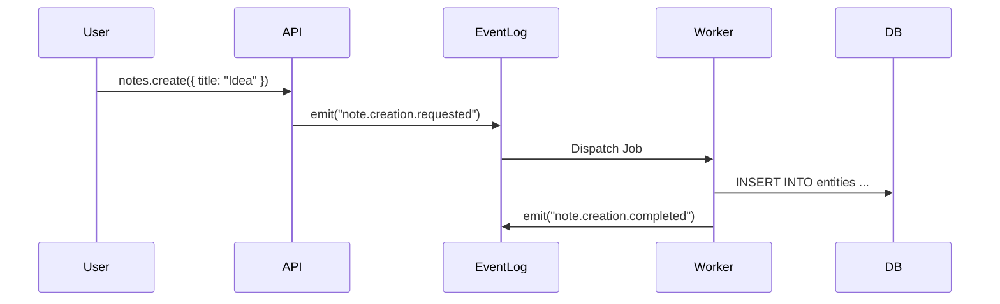
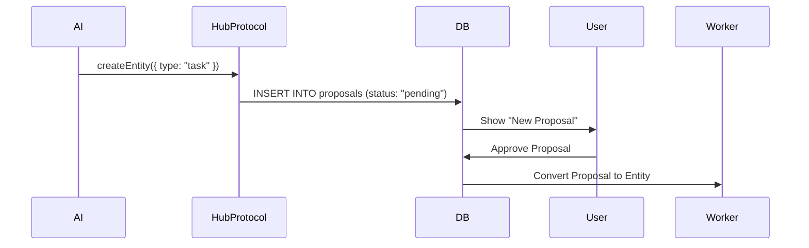

# Architecture

> **Synap** is a Personal Data Operating System built on an **Event-Sourced** backend. We provide "Workspace as a Service" where the user owns a sovereign Data Pod.

## Core Principles

### 1. Pure Event Sourcing
Every state change is an **Event**. We do not update database rows directly from the API.
*   **Write Path**: User Action → tRPC Mutation → `emitEvent("note.created")` → Inngest Worker → DB Insert.
*   **Read Path**: tRPC Query → DB Select (Projected View).
*   **Benefit**: Infinite undo, complete audit trail, perfect sync history.

### 2. Hub & Spoke Model
*   **Hub (Data Pod)**: The central authority. Owns the data, events, and auth.
*   **Spokes (Intelligence Services)**: External AI services that connect via the **Hub Protocol**. They are stateless and interchangeable.

### 3. "Lego Bricks" Philosophy
Synap is composable.
*   **Entities**: Universal data nodes (Tasks, Notes, Persons).
*   **Relationships**: First-class connections between any two entities.
*   **Views**: Interchangeable visualizations (Table, Graph, Board) for the same data.

## System Components

### 1. The Kernel (Backend)
*   **Runtime**: Node.js 20+
*   **Database**: PostgreSQL 16 + TimescaleDB (Events) + pgvector (Embeddings).
*   **Event Bus**: Inngest (Durable execution).
*   **API**: tRPC + Hono.

### 2. The Interface (Frontend)
*   **Framework**: Next.js 15 (App Router).
*   **State**: Legend-State (Observable-based, high performance).
*   **UI System**: Tamagui (Universal styles).
*   **Local-First**: Works offline (mostly), syncs via Replicache/Zero (Planned).

### 3. The Brain (Intelligence)
*   External usage of the **Hub Protocol**.
*   Can run locally (Ollama) or in the cloud (OpenAI/Anthropic).
*   See [Artificial Intelligence](./artificial-intelligence.md).

## Data Flow Examples

### Creating a Note

### AI Proposal

