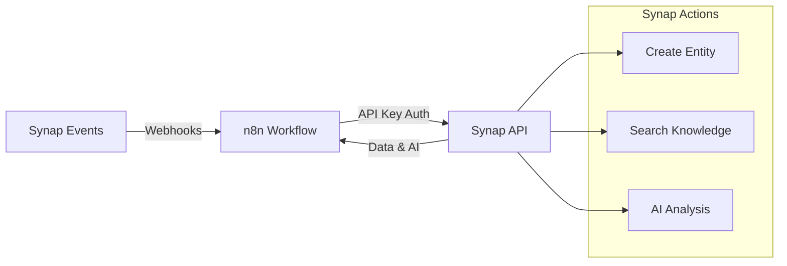

# n8n Integration

**Connect Synap to your automation workflows**

---

## Overview

Integrate Synap with [n8n](https://n8n.io) to:
- ✅ Create notes and tasks from external triggers
- ✅ Search your knowledge base semantically
- ✅ Analyze content with Synap's AI
- ✅ Receive real-time webhooks from Synap events

**Status**: 📋 Planned (4-week implementation)

---

## Architecture



---

## Quick Start

### 1. Create API Key

In Synap UI:

```
Settings > API Keys > Create New Key
  Name: "n8n Production"
  Scopes: notes, tasks, entities, webhook:manage
  Expiration: 90 days
  
→ Copy: synap_user_abc123xyz...
```

:::warning Save Your Key
The API key is shown only once. Store it securely (e.g., in n8n credentials).
:::

### 2. Configure n8n Credentials

In n8n:

```
Credentials > Add > HTTP Header Auth
  Name: Synap API Key
  Header Name: Authorization
  Header Value: Bearer synap_user_abc123xyz...
```

### 3. Use in Workflows

**HTTP Request Node**:
```json
{
  "method": "POST",
  "url": "https://api.synap.ai/api/n8n/entities",
  "authentication": "predefinedCredentialType",
  "nodeCredentialType": "synapApi",
  "body": {
    "type": "note",
    "content": "{{$json.text}}"
  }
}
```

---

## Available Actions

### Create Entity

Create notes, tasks, or projects:

```typescript
POST /api/n8n/entities
Authorization: Bearer synap_user_...
{
  "type": "note",
  "title": "Meeting Notes",
  "content": "Discussed Q1 roadmap...",
  "tags": ["meeting", "q1"]
}

// Response
{
  "success": true,
  "entityId": "uuid-...",
  "eventId": "uuid-..."
}
```

**Supported Types**:
- `note` - Create a note
- `task` - Create a task
- `project` - Create a project

### Search Entities

Semantic search across your knowledge:

```typescript
POST /api/n8n/search
Authorization: Bearer synap_user_...
{
  "query": "AI project ideas",
  "limit": 10,
  "type": "note"  // Optional: filter by type
}

// Response
{
  "results": [
    {
      "entityId": "uuid-...",
      "title": "AI Integration Roadmap",
      "type": "note",
      "preview": "Ideas for AI features...",
      "relevanceScore": 0.95
    }
  ],
  "count": 10
}
```

### AI Analysis

Analyze content with Synap's AI:

```typescript
POST /api/n8n/analyze
Authorization: Bearer synap_user_...
{
  "content": "Let's schedule a meeting next week to discuss the new product launch. We need to finalize the marketing strategy and assign tasks.",
  "analysisTypes": ["tags", "summary", "tasks"]
}

// Response
{
  "tags": ["meeting", "product-launch", "marketing"],
  "summary": "Schedule meeting to discuss product launch marketing strategy",
  "tasks": [
    "Finalize marketing strategy",
    "Assign tasks to team"
  ],
  "sentiment": "neutral"
}
```

**Analysis Types**:
- `tags` - Extract relevant tags
- `summary` - Generate summary
- `tasks` - Extract action items
- `sentiment` - Analyze sentiment

---

## Webhooks

Receive real-time notifications from Synap:

### 1. Create n8n Webhook

In n8n, create a **Webhook** trigger node:
```
Webhook URL: https://n8n.acme.com/webhook/synap-events
HTTP Method: POST
```

### 2. Subscribe in Synap

```typescript
POST /trpc/webhooks.create
Authorization: Bearer synap_user_...
{
  "name": "n8n Task Notifications",
  "url": "https://n8n.acme.com/webhook/synap-events",
  "eventTypes": [
    "entities.update.validated",
    "entities.create.validated"
  ],
  "secret": "your-webhook-secret"  // For HMAC validation
}
```

### 3. Validate Webhook Signature

In n8n, validate the HMAC signature:

```javascript
// Code node in n8n
const crypto = require('crypto');

const signature = $headers['x-synap-signature'];
const secret = $credentials.synapWebhookSecret;
const body = JSON.stringify($input.all());

const expectedSignature = crypto
  .createHmac('sha256', secret)
  .update(body)
  .digest('hex');

if (signature !== expectedSignature) {
  throw new Error('Invalid webhook signature');
}

return $input.all();
```

### 4. Handle Event

```javascript
// Event payload
{
  "id": "event-uuid",
  "type": "task.completed",
  "data": {
    "taskId": "uuid",
    "title": "Finish quarterly report",
    "completedAt": "2025-12-07T18:00:00Z"
  },
  "userId": "user-123",
  "timestamp": "2025-12-07T18:00:01Z"
}
```

**Available Events**:
- `entities.create.validated` - New entity created
- `entities.update.validated` - Entity modified
- `documents.create.validated` - New document created
- `conversationMessages.create.validated` - New message

**Note**: Filter by entity `type` in your webhook handler to get task/note specific events.

---

## Example Workflows

### 1. Email to Note

**Trigger**: New email in Gmail  
**Action**: Create Synap note with AI tags

```json
[
  {
    "node": "Gmail Trigger",
    "type": "n8n-nodes-base.gmailTrigger",
    "parameters": {
      "event": "messageReceived"
    }
  },
  {
    "node": "Analyze Email",
    "type": "n8n-nodes-base.httpRequest",
    "parameters": {
      "url": "https://api.synap.ai/api/n8n/analyze",
      "method": "POST",
      "body": {
        "content": "={{$json.body}}",
        "analysisTypes": ["tags", "summary"]
      }
    }
  },
  {
    "node": "Create Note",
    "type": "n8n-nodes-base.httpRequest",
    "parameters": {
      "url": "https://api.synap.ai/api/n8n/entities",
      "method": "POST",
      "body": {
        "type": "note",
        "title": "={{$json.subject}}",
        "content": "={{$json.body}}",
        "tags": "={{$node[\"Analyze Email\"].json.tags}}"
      }
    }
  }
]
```

### 2. Task Completion → Slack

**Trigger**: Synap webhook `task.completed`  
**Action**: Post to Slack

```json
[
  {
    "node": "Synap Webhook",
    "type": "n8n-nodes-base.webhook",
    "parameters": {
      "path": "synap-task-complete"
    }
  },
  {
    "node": "Validate Signature",
    "type": "n8n-nodes-base.code",
    "parameters": {
      "jsCode": "// HMAC validation code from above"
    }
  },
  {
    "node": "Post to Slack",
    "type": "n8n-nodes-base.slack",
    "parameters": {
      "channel": "#tasks",
      "text": "✅ Task completed: {{$json.data.title}}"
    }
  }
]
```

### 3. Daily Knowledge Search

**Trigger**: Cron (daily 9am)  
**Action**: Search Synap, send digest email

```json
[
  {
    "node": "Schedule",
    "type": "n8n-nodes-base.cron",
    "parameters": {
      "cronExpression": "0 9 * * *"
    }
  },
  {
    "node": "Search Synap",
    "type": "n8n-nodes-base.httpRequest",
    "parameters": {
      "url": "https://api.synap.ai/api/n8n/search",
      "method": "POST",
      "body": {
        "query": "action items from yesterday",
        "limit": 20
      }
    }
  },
  {
    "node": "Send Email",
    "type": "n8n-nodes-base.emailSend",
    "parameters": {
      "to": "user@example.com",
      "subject": "Daily Action Items",
      "text": "={{$json.results.map(r => r.title).join('\\n')}}"
    }
  }
]
```

---

## Rate Limits

| Operation | Limit | Window |
|-----------|-------|--------|
| Create Entity | 100 requests | /minute |
| Search | 100 requests | /minute |
| AI Analysis | 50 requests | /minute |

:::info Upgrading Limits
Contact support for higher limits on enterprise plans.
:::

---

## Error Handling

### 401 Unauthorized

**Cause**: Invalid or expired API key

**Solution**:
1. Check API key in n8n credentials
2. Verify format: `Bearer synap_user_...`
3. Check expiration in Synap UI

### 403 Forbidden

**Cause**: Missing required scope

**Solution**: Create new API key with additional scopes

### 429 Rate Limit Exceeded

**Cause**: Too many requests

**Solution**: Implement retry with exponential backoff

```javascript
// n8n Code node
const maxRetries = 3;
let retries = 0;

while (retries < maxRetries) {
  try {
    const response = await $http.request(options);
    return response;
  } catch (error) {
    if (error.response?.status === 429) {
      retries++;
      await new Promise(r => setTimeout(r, Math.pow(2, retries) * 1000));
    } else {
      throw error;
    }
  }
}
```

---

## Security Best Practices

1. ✅ **Use HTTPS** - Always for production n8n instances
2. ✅ **Validate webhooks** - Check HMAC signatures
3. ✅ **Rotate keys** - Every 90 days
4. ✅ **Minimum scopes** - Only grant necessary permissions
5. ✅ **Monitor usage** - Track API calls in Synap UI

---

## Roadmap

### Phase 1: Core Actions (Week 1-2)
- ✅ Create Entity API
- ✅ Search API
- ✅ AI Analysis API
- ✅ API Key authentication

### Phase 2: Webhooks (Week 3)
- ✅ Webhook subscriptions
- ✅ HMAC signature validation
- ✅ Event delivery with retries

### Phase 3: Community Nodes (Week 4)
- 🔄 Official n8n node pack
- 🔄 npm package: `n8n-nodes-synap`
- 🔄 Published to n8n community

---

## Support

- **Documentation**: [api.synap.ai/docs](https://api.synap.ai/docs)
- **GitHub**: [github.com/synaptik-ai/synap](https://github.com/synaptik-ai/synap)
- **Discord**: [discord.gg/synap](https://discord.gg/synap)

---

**Next:**
- [API Reference](../api/data-pod/overview.md) - Complete API docs
- [Authentication](../api/data-pod/authentication.md) - API key management
