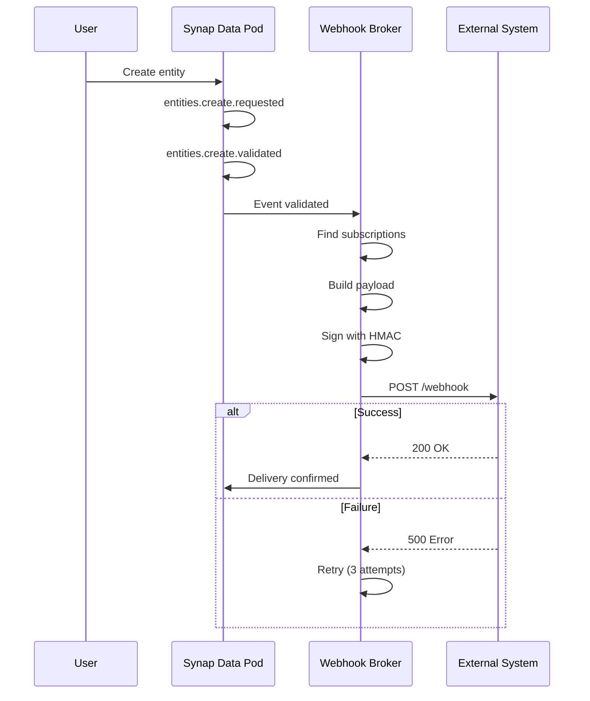

# Webhooks Guide

**Connect Synap to any external system**

---

## Overview

Webhooks enable **real-time event delivery** from your Synap data pod to external systems. When any event occurs, Synap can POST it to your configured webhook URL immediately.

**Use Cases**:
- ✅ Notify Slack when tasks are completed
- ✅ Trigger n8n workflows on entity creation
- ✅ Sync data to external databases
- ✅ Build custom integrations with any HTTP endpoint
- ✅ Chain multiple systems together

---

## How Webhooks Work

### Flow



### Event Delivery Guarantee

- **Automatic retries**: 3 attempts with exponential backoff
- **Retry schedule**: 1s, 4s, 16s
- **Dead letter queue**: Failed events logged for manual review
- **At-least-once delivery**: Events may be delivered multiple times (idempotency recommended)

---

## Creating a Webhook

### 1. Set Up Endpoint

Your webhook endpoint must:
- Accept HTTP POST requests
- Return 2xx status code for success
- Respond within 30 seconds
- Handle duplicate deliveries idempotently

**Example (Express.js)**:
```typescript
app.post('/synap-webhook', async (req, res) => {
  try {
    // 1. Validate signature
    const signature = req.headers['x-synap-signature'];
    if (!validateSignature(req.body, signature)) {
      return res.status(401).send('Invalid signature');
    }
    
    // 2. Process event
    const event = req.body;
    await processEvent(event);
    
    // 3. Return success
    res.status(200).send('OK');
  } catch (error) {
    res.status(500).send('Processing failed');
  }
});
```

---

### 2. Subscribe via API

**Using tRPC**:
```typescript
import { trpc } from './trpc';

const subscription = await trpc.webhooks.create.mutate({
  name: 'Slack Task Notifications',
  url: 'https://hooks.slack.com/services/YOUR/WEBHOOK/URL',
  eventTypes: [
    'entities.create.validated',
    'entities.update.validated',
  ],
  secret: 'your-secret-key-for-hmac',  // Generate securely
});

console.log('Webhook created:', subscription.id);
```

**Using HTTP**:
```bash
curl -X POST https://api.synap.ai/trpc/webhooks.create \
  -H "Authorization: Bearer synap_user_..." \
  -H "Content-Type: application/json" \
  -d '{
    "name": "Slack Task Notifications",
    "url": "https://hooks.slack.com/services/YOUR/WEBHOOK/URL",
    "eventTypes": ["entities.create.validated"],
    "secret": "your-secret-key"
  }'
```

---

### 3. Configure Event Filtering

Subscribe to specific event types:

```typescript
// Subscribe to all entity events
eventTypes: [
  'entities.create.validated',
  'entities.update.validated',
  'entities.delete.validated',
]

// Subscribe to only task completions
eventTypes: [
  'entities.update.validated',  // Filter by data.type='task' in webhook
]

// Subscribe to all validated events (wildcard)
eventTypes: ['*.validated']

// Subscribe to everything
eventTypes: ['*']
```

---

## Webhook Payload

### Structure

```typescript
{
  // Standard SynapEvent fields
  "id": "event-uuid",
  "version": "v1",
  "type": "entities.create.validated",
  "timestamp": "2025-12-15T12:00:00Z",
  "userId": "user-123",
  "source": "api",
  
  // Event-specific data
  "data": {
    "entityId": "entity-456",
    "type": "note",
    "title": "Meeting Notes",
    "filePath": "user-123/note/entity-456.md"
  },
  
  // Optional fields
  "subjectId": "entity-456",
  "correlationId": "req-789",
  
  // Webhook metadata
  "webhook": {
    "subscriptionId": "sub-123",
    "attempt": 1,
    "deliveredAt": "2025-12-15T12:00:01Z"
  }
}
```

### Headers

```
POST /webhook HTTP/1.1
Host: your-server.com
Content-Type: application/json
X-Synap-Signature: sha256=abc123...
X-Synap-Event-Type: entities.create.validated
X-Synap-Event-Id: event-uuid
X-Synap-Delivery-Id: delivery-uuid
```

---

## Security

### HMAC Signature Validation

Synap signs every webhook with HMAC-SHA256:

```typescript
// Node.js: Validate signature
function validateSignature(body: object, signature: string): boolean {
  const secret = process.env.WEBHOOK_SECRET;
  const payload = JSON.stringify(body);
  
  const expectedSignature = crypto
    .createHmac('sha256', secret)
    .update(payload)
    .digest('hex');
  
  return `sha256=${expectedSignature}` === signature;
}
```

**Python**:
```python
import hmac
import hashlib

def validate_signature(body: bytes, signature: str) -> bool:
    secret = os.environ['WEBHOOK_SECRET'].encode()
    expected = hmac.new(secret, body, hashlib.sha256).hexdigest()
    return f"sha256={expected}" == signature
```

### Best Practices

1. ✅ **Always validate signatures** - Prevent spoofed webhooks
2. ✅ **Use HTTPS** - Encrypt data in transit
3. ✅ **Rotate secrets** - Every 90 days
4. ✅ **Implement idempotency** - Handle duplicate deliveries
5. ✅ **Log webhook IDs** - Track received events

---

## Retry Policy

### Automatic Retries

| Attempt | Delay | Total Wait |
|---------|-------|------------|
| 1 | 0s | 0s |
| 2 | 1s | 1s |
| 3 | 4s | 5s |
| 4 (final) | 16s | 21s |

### Failure Handling

```typescript
// After 3 failed attempts, webhook goes to dead letter queue
const failedWebhooks = await trpc.webhooks.listFailed.query({
  limit: 100,
});

// Manually retry
await trpc.webhooks.retry.mutate({
  deliveryId: failedWebhooks[0].id,
});
```

---

## Common Integration Patterns

### Pattern 1: Slack Notifications

**Goal**: Post to Slack when task completed

```typescript
// 1. Create webhook
await trpc.webhooks.create.mutate({
  name: 'Slack Notifications',
  url: 'https://hooks.slack.com/services/T00/B00/XXX',
  eventTypes: ['entities.update.validated'],
});

// 2. Slack webhook receives:
{
  "type": "entities.update.validated",
  "data": {
    "entityId": "task-123",
    "type": "task",
    "changes": { "status": "completed" }
  }
}

// 3. Slack endpoint formats message:
POST https://hooks.slack.com/services/T00/B00/XXX
{
  "text": "✅ Task completed: Review Q4 roadmap"
}
```

---

### Pattern 2: n8n Workflow Trigger

**Goal**: Trigger n8n workflow on entity creation

```typescript
// 1. Create n8n webhook
const n8nWebhookUrl = 'https://n8n.yourcompany.com/webhook/synap-events';

await trpc.webhooks.create.mutate({
  name: 'n8n Automation',
  url: n8nWebhookUrl,
  eventTypes: ['entities.create.validated'],
  secret: 'n8n-webhook-secret',
});

// 2. n8n receives event and can:
// - Search Synap knowledge base
// - Create related entities
// - Send emails
// - Update external databases
```

See [n8n Integration Guide](./n8n.md) for complete examples.

---

### Pattern 3: External Database Sync

**Goal**: Sync Synap entities to external Postgres

```typescript
// 1. Create webhook
await trpc.webhooks.create.mutate({
  name: 'External DB Sync',
  url: 'https://api.yourcompany.com/synap-sync',
  eventTypes: [
    'entities.create.validated',
    'entities.update.validated',
    'entities.delete.validated',
  ],
  secret: 'db-sync-secret',
});

// 2. Sync endpoint processes events:
app.post('/synap-sync', async (req, res) => {
  const event = req.body;
  
  switch (event.type) {
    case 'entities.create.validated':
      await externalDB.insert('entities', event.data);
      break;
    case 'entities.update.validated':
      await externalDB.update('entities', event.data.entityId, event.data.changes);
      break;
    case 'entities.delete.validated':
      await externalDB.delete('entities', event.data.entityId);
      break;
  }
  
  res.sendStatus(200);
});
```

---

### Pattern 4: Multi-System Chaining

**Goal**: Chain Synap → Slack → Jira

```typescript
// Synap event → Webhook 1 (Slack) → Webhook 2 (Jira)

// 1. Synap publishes entities.create.validated
// 2. Slack webhook receives, posts message
// 3. Slack workflow triggers Jira webhook
// 4. Jira creates issue
// 5. Jira webhook back to Synap (creates linked entity)
```

---

## Managing Webhooks

### List Subscriptions

```typescript
const webhooks = await trpc.webhooks.list.query();

console.log('Active webhooks:', webhooks.length);
webhooks.forEach(w => {
  console.log(`${w.name}: ${w.url}`);
  console.log(`Events: ${w.eventTypes.join(', ')}`);
});
```

### Update Subscription

```typescript
await trpc.webhooks.update.mutate({
  id: 'webhook-123',
  eventTypes: [
    'entities.create.validated',  // New event type
    'documents.create.validated',
  ],
});
```

### Pause/Resume

```typescript
// Temporarily pause
await trpc.webhooks.update.mutate({
  id: 'webhook-123',
  active: false,
});

// Resume
await trpc.webhooks.update.mutate({
  id: 'webhook-123',
  active: true,
});
```

### Delete Subscription

```typescript
await trpc.webhooks.delete.mutate({
  id: 'webhook-123',
});
```

---

## Monitoring & Debugging

### Check Delivery Status

```typescript
// Recent deliveries
const deliveries = await trpc.webhooks.getDeliveries.query({
  subscriptionId: 'webhook-123',
  limit: 50,
});

deliveries.forEach(d => {
  console.log(`${d.event.type}: ${d.status}`);
  if (d.status === 'failed') {
    console.log(`Error: ${d.error}`);
  }
});
```

### Test Webhook

```typescript
// Send test event
await trpc.webhooks.test.mutate({
  id: 'webhook-123',
  eventType: 'entities.create.validated',
});

// Check your endpoint received:
{
  "type": "entities.create.validated",
  "data": { "test": true },
  "webhook": { "test": true }
}
```

---

## Rate Limits

| Operation | Limit |
|-----------|-------|
| **Webhooks per user** | 100 |
| **Deliveries per second** | 100 |
| **Payload size** | 1MB |
| **Timeout** | 30s |

---

## Troubleshooting

### Webhook Not Receiving Events

**Check**:
1. URL is publicly accessible
2. Returns 2xx status code
3. Event type matches subscription
4. Webhook is active (`active: true`)
5. No firewall blocking Synap IPs

### Signature Validation Failing

**Check**:
1. Secret matches exactly (no extra spaces)
2. Using raw request body (not parsed JSON)
3. Comparing hex strings correctly
4. Signature header present

**Debug**:
```typescript
console.log('Received signature:', req.headers['x-synap-signature']);
console.log('Calculated signature:', `sha256=${expectedHash}`);
console.log('Body:', JSON.stringify(req.body));
```

### High Failure Rate

**Solutions**:
1. Increase timeout (ensure &lt;30s response)
2. Process async (return 200 immediately, process in background)
3. Check server logs for errors
4. Verify network stability

---

## Best Practices

### 1. Idempotency

```typescript
// Track processed events to avoid duplicates
const processedEvents = new Set();

app.post('/webhook', async (req, res) => {
  const eventId = req.body.id;
  
  if (processedEvents.has(eventId)) {
    return res.status(200).send('Already processed');
  }
  
  await processEvent(req.body);
  processedEvents.add(eventId);
  
  res.sendStatus(200);
});
```

### 2. Async Processing

```typescript
// Return 200 immediately, process in background
app.post('/webhook', async (req, res) => {
  // Validate signature
  if (!validateSignature(req.body, req.headers['x-synap-signature'])) {
    return res.sendStatus(401);
  }
  
  // Queue for background processing
  await queue.add('process-webhook', req.body);
  
  // Return immediately
  res.sendStatus(200);
});
```

### 3. Error Handling

```typescript
app.post('/webhook', async (req, res) => {
  try {
    await processEvent(req.body);
    res.sendStatus(200);
  } catch (error) {
    logger.error({ error, event: req.body }, 'Webhook processing failed');
    
    // Return 500 to trigger retry
    res.status(500).send('Processing failed, will retry');
  }
});
```

---

## Next Steps

- [n8n Integration](./n8n.md) - Complete n8n workflow examples
- [Event Types Catalog](../api/event-types-catalog.md) - All available events
- [Event Architecture](../architecture/events/event-architecture.md) - Understanding events
- [API Reference](../api/data-pod/overview.md) - Full API docs
